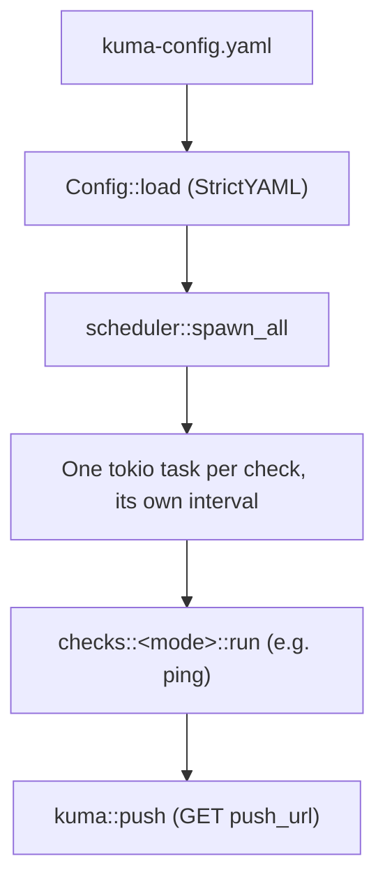

# kuma-remote

[](LICENSE.md)

Kuma Remote is a console client for [Uptime Kuma](https://github.com/louislam/uptime-kuma) push monitors.
It runs a set of locally-defined checks against hosts on your network and reports each result (up/down, latency, message) to that check's Uptime Kuma push URL, so hosts that can't be reached directly by your Kuma server can still be monitored from the machine that runs `kuma-remote`.

It runs as a long-lived daemon: each configured check runs independently on its own interval for as long as the process is alive.

---

## Prerequisites

- Rust 1.94 or later (edition 2024) to build from source.
- Network access from the machine running `kuma-remote` to both the checked hosts and the Uptime Kuma push URL.
- No administrator/root privileges are required. On Windows, pings use the native `IcmpSendEcho` API; on Linux/macOS, the OS `ping` binary is invoked directly (no raw-socket capability needed).
- If the push URL sits behind a reverse proxy or WAF, note that `kuma-remote` sends push requests with a desktop-Chrome-on-Windows `User-Agent` header (not a generic HTTP-client string) specifically to avoid bot-protection false positives; adjust any allowlists accordingly if you rely on user-agent filtering.
- Unless `auto_update: false` is set, the machine also needs outbound HTTPS access to `api.github.com` and `github.com` (release asset downloads), and the process needs write access to its own install directory so it can replace its executable.

## Building

```sh
cargo build --release
```

The compiled binary is written to `target/release/kuma-remote` (`kuma-remote.exe` on Windows).

## Configuration

Checks are defined in a [StrictYAML](https://hitchdev.com/strictyaml/) file. If `--config` is not given, `kuma-remote` looks in the current directory for `kuma-remote.yaml`, then `kuma-config.yaml`, then `config.yaml`, using the first one that exists. See `kuma-remote.example.yaml` for a working example.

```yaml
debug: false #=-- optional, defaults to false
report_run_failures: true #=-- optional, defaults to true
auto_update: true #=-- optional, defaults to true; checks GitHub for a newer release at startup and self-updates
service_mode: false #=-- optional, defaults to false; true = defer restart-on-update and single-instance to a process supervisor instead of self-managing them
instance_lock: true #=-- optional, defaults to true; ignored when service_mode is true. Set false to disable the single-instance guard
instance_lock_port: 51247 #=-- optional, defaults to 51247; loopback port used only as a single-instance mutex, change if it collides with something else on the host. Must be non-zero when the lock is in effect (instance_lock: true and service_mode: false) — 0 is rejected at startup
slow_download_mode: false #=-- optional, defaults to false; false = update download capped at 5 minutes total; true = no total cap, only aborts after a full minute with no data (a genuine stall)

checks:
  - id: self
    name: "Remote Agent Heartbeat"
    mode: heartbeat #=-- always reports Up with msg "Heartbeat"; host is optional
    host: 8.8.8.8 #=-- optional — if set, also pings and includes latency, good for pinging 8.8.8.8 — or similar — for internet latency
    push_url: "https://kuma.mydomain.com/api/push/HbEaT456"
    interval: 60s
    
  - id: web01
    name: "Prod Web Server"
    mode: ping
    host: 192.168.1.10
    push_url: "https://kuma.mydomain.com/api/push/AbC123XyZ"
    interval: 60s #=-- It's recommended to set the heartbeat interval to at least 30 seconds longer than the longest expected check interval

  - id: db01
    name: "Database Host"
    mode: ping
    host: db.internal.local
    push_url: "https://kuma.mydomain.com/api/push/QwErTy987"
    interval: 5m
```

Top-level fields:

- `debug` — optional, defaults to `false`. When `true`, every configured check is logged at startup, and every push logs the exact request URL sent to Kuma, including its query string. Leave this off unless you're actively troubleshooting: a push URL is itself a bearer credential (anyone who has it can push status to your monitor), so `kuma-remote` doesn't log it by default.
- `report_run_failures` — optional, defaults to `true`. When `true`, a check run that errors out entirely (e.g. an unresolvable hostname) is also pushed to Kuma as a `down` status with the error as `msg`, in addition to being logged. On by default: without it, a run error sends no heartbeat at all, leaving the Kuma monitor stuck on its last known state instead of reflecting the failure. Set to `false` to only log run errors and never push for them.
- `auto_update` — optional, defaults to `true`. See [Auto-Update](#auto-update) below.
- `service_mode` — optional, defaults to `false`. See [Auto-Update](#auto-update) below.
- `instance_lock` — optional, defaults to `true`. Ignored when `service_mode` is `true`. See [Auto-Update](#auto-update) below.
- `instance_lock_port` — optional, defaults to `51247`. See [Auto-Update](#auto-update) below.
- `slow_download_mode` — optional, defaults to `false`. See [Auto-Update](#auto-update) below.
- `checks` — the list of checks to run, described below.

Fields, per entry under `checks`:

- `id` — Required. Unique slug for this check. Duplicate ids are a startup error.
- `name` — Required. Human-readable name, used only in logs.
- `mode` — Required. Check strategy: `ping` or `heartbeat` (see Check Modes below).
- `host` — IP address or hostname to check. Required for `ping`. Optional for `heartbeat`: when set, it's also pinged and a successful latency is included in the push; a missing host, or a failed/timed-out ping, doesn't affect the heartbeat's `Up` status.
- `push_url` — Required. Full Uptime Kuma push URL for this monitor. Kuma's dashboard displays the push URL with a `?status=up&msg=OK&ping=` example suffix attached for you to copy as a curl command; `kuma-remote` builds its own `status`/`msg`/`ping` query string, so if `push_url` still has a `?...` suffix on load, it's stripped automatically and logged as a warning rather than rejected.
- `interval` — Required. How often to run the check, as a duration string (`30s`, `5m`, `1h`, ...).

The config file must define at least one check; a zero-length `interval`, a duplicate `id`, or a `ping` check missing `host` is rejected at startup.

### Environment variables

- `RUST_LOG` — Controls log verbosity/filtering (`tracing_subscriber::EnvFilter` syntax). Defaults to `info` for all targets if unset.

## Usage

```sh
kuma-remote [--config <path>]
kuma-remote --stop [--config <path>]
```

- `-c`, `--config <path>` — Path to the StrictYAML config file. Default: first of `kuma-remote.yaml`, `kuma-config.yaml`, `config.yaml` (checked in that order) that exists.
- `--stop` — Asks a running instance to shut down gracefully, then exits immediately; does not otherwise start `kuma-remote`. Requires `--config` (or the default lookup) to resolve to the *same* config a running instance is using, since that's what determines the port to connect to. Only works when the single-instance lock is in use (`service_mode: false` and `instance_lock: true`, the defaults) — see [Auto-Update](#auto-update).
- `-h`, `--help` — Print help.
- `-V`, `--version` — Print version.

`kuma-remote` has one mode of operation: it loads the config, starts one background task per check, and runs until interrupted (Ctrl-C / SIGINT, or a `--stop` request), at which point all check tasks stop and the process exits. There is no one-shot/run-once flag; scheduling is handled internally, not by an external cron/Task Scheduler. To run continuously across reboots, wrap it in a Windows service or a systemd unit.

Ctrl-C reliably stops whichever instance you directly launched, but not necessarily one that's the result of a self-triggered update: the replacement process spawned after an update (see [Auto-Update](#auto-update)) is a detached process your shell never launched, so that same terminal's Ctrl-C may not reach it even though it's still attached to the same console. `--stop` works regardless, since it targets whichever process currently holds the single-instance lock rather than relying on the shell to forward a signal to the right process.

## Output

`kuma-remote` writes structured log lines to stdout only (via `tracing_subscriber`); there is no log file. On boot, before loading config, it logs its own name, version, and author(s). Each check logs one `up` or `down` line per run, including the check id, name, and (for ping) latency in milliseconds or the failure reason. There are no report tables — each push result is sent directly to Uptime Kuma, which is the system of record for check history.

## Architecture



Each check's task loop is independent: a slow or failing check never blocks or delays any other check's schedule.

## Auto-Update

Unless `auto_update: false` is set, `kuma-remote` checks the latest GitHub release of this repo at startup, before starting any checks. It compares the SHA-256 of its own running executable (not its version number) against the digest GitHub publishes for the matching release asset. If they differ, it downloads the new executable and verifies its hash, then replaces itself in place. What happens next depends on whether this process actually holds the single-instance lock (see below), not just on `service_mode`:

- **Lock held (`service_mode: false` and `instance_lock: true`, the defaults)** — spawns a replacement process running the new binary, then exits. The update takes effect immediately, with no supervisor (Windows service manager, systemd, ...) required.
- **Lock not held (`service_mode: true`, or `instance_lock: false`, or the lock claim came back unavailable)** — just exits, full stop; no replacement process spawned. Use `service_mode: true` when a process supervisor is already responsible for restarting `kuma-remote` and you'd rather it own that job entirely; `instance_lock: false` falls back to the same behavior since self-spawning without the lock's protection would risk an unprotected duplicate instance. **Without a supervisor configured to restart on exit, an update in this mode will leave the process stopped** until something else starts it again — if this happens because the lock claim came back unavailable (some other process is squatting on `instance_lock_port`) rather than because you deliberately configured it that way, it's logged as an error rather than a routine notice, since that's an unexpected condition worth investigating.

Self-spawning on its own would double-report every check if a process supervisor *also* restarts the process on exit (e.g. NSSM's default behavior, or a systemd unit with `Restart=always`) — both the self-spawned replacement and the supervisor's own fresh instance would end up running permanently. This is closed by a single-instance lock: every process (self-spawned, supervisor-spawned, or a plain accidental double-launch) claims a loopback TCP port (`instance_lock_port`, default `51247`) before doing any real work, whether or not an update is even in play. Only one can hold it at a time; whichever loses just exits immediately without touching any checks. To tell a genuine second `kuma-remote` instance apart from some unrelated process that merely happens to be bound to the same port, the lock holder answers a short identity handshake — a collision with an unrelated occupant is treated as "proceed anyway, without the guarantee," not as a duplicate instance. Set `instance_lock: false` to disable this guard entirely (not recommended unless you have a specific reason to); `instance_lock_port` must be a fixed non-zero port when the lock is in effect — port `0` would let the OS hand out a different port on every bind attempt, defeating the lock, so `kuma-remote` refuses to start with that combination.

One consequence of the single-instance lock, when it's in use: **only one `kuma-remote` instance can run per machine at a time** — if you need two independent sets of checks, put them all in one config file instead of running two instances.

The same lock port doubles as a graceful-shutdown channel: `kuma-remote --stop` connects to it and asks whichever instance holds it to shut down, which is the reliable way to stop an instance that's the result of a self-triggered update (see [Usage](#usage) above for why plain Ctrl-C can't always reach it).

Any failure in this process — no network access, GitHub rate limiting, no matching release asset, no write permission to the install directory, a repeated failure to spawn a replacement that stays running, and so on — is logged and otherwise ignored; it never prevents `kuma-remote` from starting with the currently installed version. A connection that can't be established within 7 seconds is logged as `Update check failed: Timeout` and skipped. The release download itself streams the asset with progress logged every 5 seconds, and is bounded by `slow_download_mode`: by default (`false`) the whole download is capped at 5 minutes total even if it's still making progress, so a connection that's technically up but impractically slow fails fast; set it to `true` to lift that total cap and instead only abort if the download goes a full minute without receiving any data at all (a genuine stall). The downloaded asset is also capped at 200 MiB as a safety net against a misconfigured or unexpectedly huge release, and after spawning a replacement process this process confirms it's still running (not just that it started) before releasing the single-instance lock and exiting.

## Modules

- `main.rs` — CLI parsing (including `--stop`), config load, single-instance claim, task spawning, shutdown on Ctrl-C or a `--stop` request.
- `config.rs` — StrictYAML config schema (`Config`, `CheckConfig`, `CheckMode`) and validation.
- `scheduler.rs` — Per-check interval loop; dispatches to the check's mode and pushes the result.
- `checks/ping.rs` — Ping check: single ICMP echo per run, cross-platform via the `pinger` crate.
- `checks/heartbeat.rs` — Heartbeat check: always reports up, optionally pinging `host` for latency.
- `kuma.rs` — Uptime Kuma push client (builds the `status`/`msg`/`ping` query string, sends the GET request).
- `logging.rs` — `tracing` subscriber setup.
- `updater.rs` — checks GitHub's latest release for a newer build, self-replaces and restarts when found, guards against duplicate instances via a single-instance TCP lock with an identity handshake, and serves `--stop` requests on that same port.

## Check Modes

- `ping` — Sends a single ICMP echo to `host` and reports latency (up) or the failure reason (down). `host` is required.
- `heartbeat` — Always reports up with message "Heartbeat", signaling the `kuma-remote` process itself is alive rather than testing reachability.
  - `host` is optional; if set, it's also pinged once and a successful latency is included, but a failed or missing ping never turns the heartbeat down.

## License

[](LICENSE.md)

This project is licensed under the **PolyForm Noncommercial License 1.0.0**.

- **Permitted:** Personal use, hobby projects, research, and non-commercial organization use.
- **Prohibited:** Any commercial application, monetary gain, or use for commercial advantage.

For full terms, please read the [LICENSE](LICENSE.md) file.
